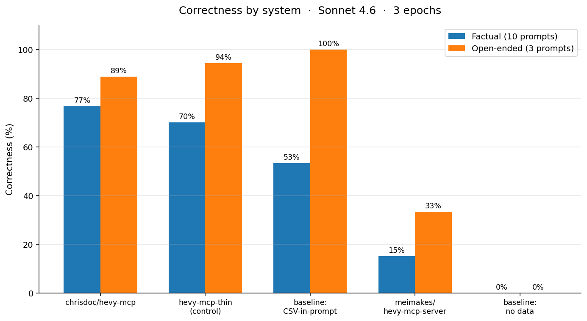
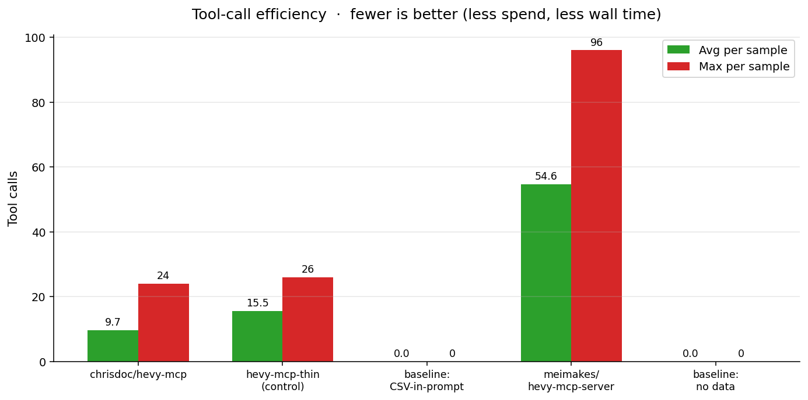
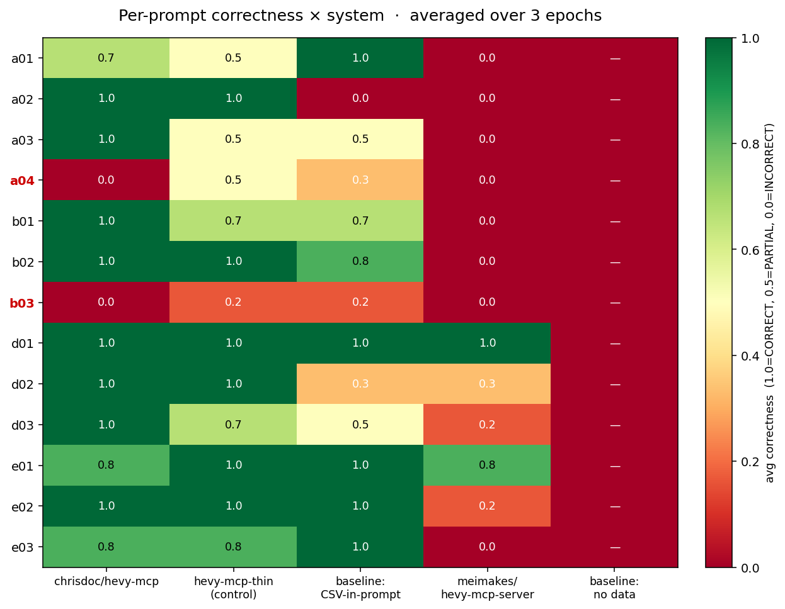
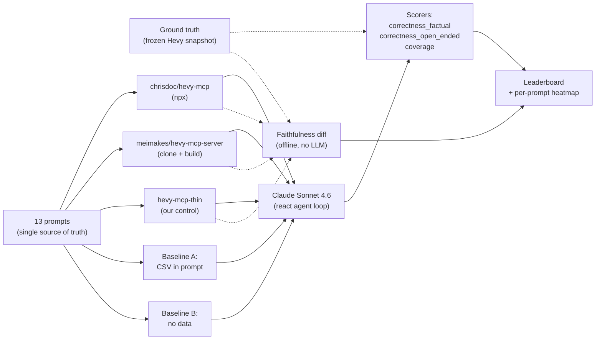

# hevy-mcp-eval

An eval suite for [Hevy](https://www.hevyapp.com/) MCP servers. Tests whether adding an MCP to a model actually helps a lifter, vs. simpler baselines — and which Hevy MCP implementation adds the most value.

Built on [Inspect AI](https://inspect.aisi.org.uk/) (UK AISI). Run against one real lifter's 17-month Hevy history (169 workouts, 22 routines, 439 exercise templates).

---

## The headline

> **The MCP layer adds only ~7 points of factual correctness over a 1:1 wrapper of the underlying API. MCPs beat CSV-in-prompt on factual retrieval (best MCP +24 pts), but CSV ties or beats every MCP on open-ended programming questions. The gap between "best MCP" and "no MCP" is mostly about retrieval ergonomics — the data, not the design.**

## Leaderboard

| Rank | System | Factual | Open-ended | Coverage | Avg tool calls | Avg tokens |
|---|---|---|---|---|---|---|
| 1 | **chrisdoc/hevy-mcp** | **77%** (23/30) | 89% (8/9) | 100% | 9.7 | 303K |
| 2 | **hevy-mcp-thin** *(our control)* | 70% (21/30) | **94%** (8.5/9) | 100% | 15.5 | 375K |
| 3 | baseline: CSV-in-prompt | 53% (16/30) | **100%** (9/9) | 85% | — | 293K |
| 4 | meimakes/hevy-mcp-server | 15% (4.5/30) | 33% (3/9) | **41%** | 54.6 | 660K |
| 5 | baseline: no data | 0% (0/30) | 0% (0/9) | 10% | — | 3K |

*5 systems × 13 prompts × 3 epochs · `claude-sonnet-4-6` · run date 2026-05-24 · total spend ~$140*



## TL;DR

- **chrisdoc/hevy-mcp wins** the leaderboard. 77% factual, 100% coverage, 9.7 avg tool calls. Earns its 240 stars.
- **The MCP layer is worth ~7 points of correctness over raw API access.** Our control (`hevy-mcp-thin`, a 1:1 wrapper we built) scored 70% factual. The best real MCP scored 77%. Pure API + a capable LLM gets you most of the way.
- **For open-ended programming questions, CSV-in-prompt is competitive or better than any MCP.** When the data fits in context, the model writes good programming advice from it — no MCP needed.
- **For factual retrieval, MCPs clearly beat CSV (+24 pts on the best one).** CSV-in-prompt hallucinates: in one case it fabricated a 52.2 kg × 8-rep set on a date that only had 49.9 kg sets. MCPs force fetch-by-id, which constrains hallucination.
- **meimakes/hevy-mcp-server failed catastrophically (41% coverage)** — and it's a *design* failure, not an implementation bug. Its `get-workouts` requires `page_size ≤ 10`, forcing 55 average tool calls and exhausting the model's message budget. More tools is not a better MCP.
- **Two prompts no system solved reliably:** exercise co-occurrence patterns and "PR'd in window A but not window B" temporal differencing. Real gaps in current MCP design.

## What is `hevy-mcp-thin`?

`hevy-mcp-thin` is **a Python MCP server we built specifically to function as the control in this eval.** It lives in [`systems/hevy_mcp_thin/`](systems/hevy_mcp_thin/) — ~80 lines of code that exposes one MCP tool per Hevy REST endpoint, calls the corresponding `hevy_client.py` method, and returns the raw JSON response from the Hevy API verbatim. **No aggregation. No transformation. No derived fields. No analytics.**

Why we built it: in eval-design terms, *we needed a control to isolate the construct under test.* Without `hevy-mcp-thin`, the leaderboard could only tell us *which MCP is best* — not *how much the MCP layer's design contributes vs. how much is just having API access at all.* The thin control answers the second question directly: subtract its score from the best MCP's score, and you get the marginal value of MCP design.

Architecturally, the thin control is **identical** to the treatments — same stdio MCP protocol, same `mcp_server_stdio` integration with Inspect, same `react` agent loop, same scorers. The only difference is what's inside the tool implementations. That makes the comparison apples-to-apples in a way "MCP vs CSV-in-prompt" can never be.

The thin control's score (70% factual) ended up being the most surprising number in the eval. The best real MCP beat it by 7 points. That gap — not the gap to the no-data baseline, not the gap to CSV — is the answer to *"what does MCP design contribute?"* Everything else is API access.

## Key findings

### 1. The MCP layer adds ~7 points over a 1:1 wrapper

We pre-registered a threshold in [`DESIGN.md`](DESIGN.md) (see for in depth testing methodology): *"if no system separates from the thin control by >10%, treat as confirmation of H2."* chrisdoc beat thin by 7 points — under that bar. The MCP design surface (aggregation endpoints, summary tools, ergonomic schemas) adds modest, not transformative, value over raw API access.

This was unexpected. We assumed well-designed MCPs would meaningfully outperform a raw passthrough. They don't, by much.

### 2. CSV-in-prompt is a deceptively strong baseline — but hallucinates on facts

53% factual / 100% open-ended. With the entire 17-month workout history as ~225 KB of CSV in the prompt, the model can answer most questions reasonably well. **It hallucinated on 47% of factual prompts** — confidently inventing values that don't exist in the data — but on open-ended programming/diagnostic questions (Category E in our suite), it scored a perfect 9/9. The judge had the same data; the model wrote good programming advice grounded in it.

The implication: **if your fitness assistant's job is "answer programming/diagnostic questions about workouts," the MCP layer doesn't measurably help.** Where it earns its keep is precise factual retrieval and PR detection, where the constraint of fetch-by-id prevents fabrication.

### 3. meimakes failed on tool design, not implementation



`meimakes/hevy-mcp-server` exposes the most tools of any MCP we tested — including `get-exercise-progress` and `get-exercise-stats` (the kind of "smart" endpoints you'd think would help). But it scored 15% factual and only completed 41% of samples. The model averaged **54.6 tool calls per query** (max 96 on `b02` alone), bouncing off message limits.

Root cause: `get-workouts` rejects `page_size > 10`. Paginating 169 workouts at 10/page is 17 round-trips before the model can think. The "smart" endpoints didn't reduce that — they layered on top. **A well-designed MCP minimizes the number of calls the model needs to finish a query.** We also caught meimakes writing non-JSON to stdout in our faithfulness probe, breaking MCP protocol's response parsing. Real bug.

### 4. Two prompts no system solved reliably



The heatmap rows labeled in bold red — **a04** (top-3 co-occurring exercise pairs) and **b03** (exercises PR'd in Feb–Apr but not in May) — are the failure rows. No system solved either consistently:

- **a04:** chrisdoc 0/3, meimakes 0/3, thin 1C 1P 1I, baseline_csv 2P 1I. Cross-workout pattern matching has no MCP shortcut — every system has to scan and enumerate in-context.
- **b03:** chrisdoc 0/3, meimakes 0/3, thin 1P 2I, baseline_csv 1P 2I. Temporal differencing across two windows defeated everyone.

**These point to genuine gaps in current Hevy MCP design.** Patterns the existing tool surface doesn't help with, even when the data is fully available. Worth attention from MCP authors.

### 5. chrisdoc's response is unfaithful but effective

Our offline faithfulness check (no LLM, just structural diff against the raw Hevy API) found chrisdoc's `get-workout` strips **72 API fields** — including `start_time`, `end_time`, `routine_id`, `created_at`, `updated_at` — and adds 67 derived fields. By byte-for-byte standards, it's a heavy transformation, not a passthrough.

Yet chrisdoc still scored 3/3 CORRECT on `d02` (workout timestamp + duration retrieval). The model used a different endpoint (`get-workouts`, which preserves `start_time` at the listing level) for that query. **chrisdoc's transformations are aggressive but its endpoint design lets the model route around them.** A design choice we'd recommend MCPs document explicitly.

## What this means for MCP authors

1. **Design for *minimum-calls-to-finish*, not for *number of endpoints*.** meimakes lost because adding more tools didn't reduce pagination. chrisdoc won because its `get-exercise-history` collapsed full-workout scans into single calls.
2. **The bar to clear is "beat a thin wrapper by >10%."** If your MCP doesn't, the wrapper is probably the right product.
3. **Pattern queries (co-occurrence, temporal differencing) are unaddressed by every MCP we tested.** Real product gap if you want to build a "smart fitness assistant."
4. **Be loud about faithfulness choices.** chrisdoc transforms; that's fine. But the model can't always tell what was stripped — and downstream evals can't either without a probe.

## Methodology



- **Framework:** [Inspect AI](https://inspect.aisi.org.uk/) with stdio MCP transports.
- **Model:** `claude-sonnet-4-6` for both generation and the open-ended rubric judge (run 3× per response and averaged).
- **Data:** one real lifter's 17-month Hevy history. Free-text notes stripped; lift data + dates preserved. See [`data/fixtures/snapshot/`](data/fixtures/snapshot/).
- **Prompts:** 13 across 4 categories (trend/aggregation, PR detection, long-tail field preservation, open-ended programming/diagnostic). See [`evals/prompts.py`](evals/prompts.py).
- **Ground truth:** computed directly from the snapshot, not via any MCP. One canonical-answer JSON per prompt in [`data/ground_truth/cache/`](data/ground_truth/cache/).
- **Control:** [`systems/hevy_mcp_thin/`](systems/hevy_mcp_thin/) — the 1:1 wrapper detailed above.
- **Faithfulness:** offline, no-LLM diff in [`scoring/faithfulness.py`](scoring/faithfulness.py).
- **Full methodology + pre-registered hypotheses:** [`DESIGN.md`](DESIGN.md) · **Full findings + per-prompt grid:** [`results/FINDINGS.md`](results/FINDINGS.md)

## Replicate

```bash
git clone https://github.com/HT224/hevy-mcp-eval && cd hevy-mcp-eval
uv sync
scripts/setup_mcps.sh                              # clones + builds meimakes; chrisdoc uses npx
cp .env.example .env                               # fill in HEVY_API_KEY + ANTHROPIC_API_KEY
uv run python scripts/freeze_snapshot.py           # pulls a fresh Hevy snapshot
uv run python -m data.ground_truth.compute_all     # computes ground truth from snapshot
scripts/run.sh                                     # ~$140, ~2 hours on Sonnet 4.6
uv run python scripts/analyze_results.py           # produces results/leaderboard.{md,csv}
uv run python scripts/make_charts.py               # regenerates the figures
uv run python scripts/run_faithfulness.py          # offline MCP-vs-API diff
```

You'll need a Hevy Pro account (their API is Pro-only) and an Anthropic API key with ~$150 of credits.

## Caveats

- **Single lifter's data.** A user with denser deadlift logging, RPE actually filled in, or barbell squats logged with weight (instead of bar-only) would surface different gaps.
- **Single model.** Findings may shift with Opus 4.7 or Haiku 4.5. Cross-model v0.2 planned.
- **Single judge model.** No judge-vs-judge sanity check was run before this release.
- **No write-operation tests.** Deferred to v0.2 to avoid test-account hygiene complexity.
- **`tomtorggler/hevy-mcp-server` not tested.** HTTP-only Cloudflare Workers deployment; deferred to v0.2.

## Roadmap

The two unsolved prompts (a04, b03) and meimakes' tool-design failure together suggest a clear gap: **there is no Hevy MCP today that handles pattern queries and temporal reasoning well, and the existing summary endpoints don't reduce pagination cost.** That's the basis for a follow-up project — *building* a better Hevy MCP.

What I'd want from a "next-generation" Hevy MCP, based on what this eval surfaced:

- **Cross-workout pattern queries** — e.g., `find_workouts_containing([X, Y])`, `top_exercise_pairs(since=...)`. Solves a04.
- **Temporal PR differencing** — e.g., `prs_in_window(start, end, exclude_subwindow=...)`. Solves b03.
- **Filtered pagination** — `get_workouts(exercise=..., muscle_group=..., since=..., until=...)` so the model doesn't have to page everything to filter in-context.
- **Faithfulness guarantees by default** — pass-through endpoints labeled as such; transformed endpoints documented explicitly with a `transformations` field in the tool schema.
- **Predictable call budgets** — every tool documents an expected upper bound on calls-to-answer-a-query, so the model can plan.

**v0.2 of this repo** will include cross-model runs (Opus 4.7, Haiku 4.5), write-operation tests, judge-vs-judge sanity checks, and the deferred `tomtorggler` MCP. A separate project (link TBD) will be a from-scratch Hevy MCP built against these findings — and re-run through this same eval suite, with the existing MCPs as the new baselines.

## About me

I'm [Himanshu Tandon](https://github.com/HT224) — a product manager and former founder. I worked at Scale AI on data quality and evaluation infrastructure, which is where the rigor in this eval design comes from: construct validity, controls, pre-registered hypotheses, and a strong preference for *isolating* what's being measured rather than running end-to-end "vibes" comparisons.

I'm also a Hevy power user and a self-taught coder (this repo was written almost entirely through [Claude Code](https://claude.com/claude-code)). This is my first OSS contribution. It exists because I couldn't find rigorous comparisons of the dozen-plus Hevy MCP servers on GitHub, and I wanted to know what the MCP layer was actually adding before building one myself.

If the methodology or findings are useful — or wrong — I'd love to hear about it. Open an issue, or reach out: htandon04@gmail.com.

## Credits

- [`chrisdoc/hevy-mcp`](https://github.com/chrisdoc/hevy-mcp) — Christopher Doczy. The 240-star leader; also the leaderboard winner here.
- [`tomtorggler/hevy-mcp-server`](https://github.com/tomtorggler/hevy-mcp-server) — Tom Torggler. Cloudflare Workers MCP; deferred testing.
- [`meimakes/hevy-mcp-server`](https://github.com/meimakes/hevy-mcp-server) — built by [@meimakes](https://x.com/meimakes). Surfaced real design lessons.
- [Hevy](https://www.hevyapp.com/) for the API + Pro tier.
- [Inspect AI](https://inspect.aisi.org.uk/) (UK AISI + Meridian Labs) for the eval framework — without first-class MCP stdio support, this eval wouldn't have a publishable framing.

This is a good-faith eval suite. Findings shouldn't be read as criticism of any author; they're observations about what current Hevy MCP designs add, where they fall short, and where the genuine open problems live.

## License

MIT
